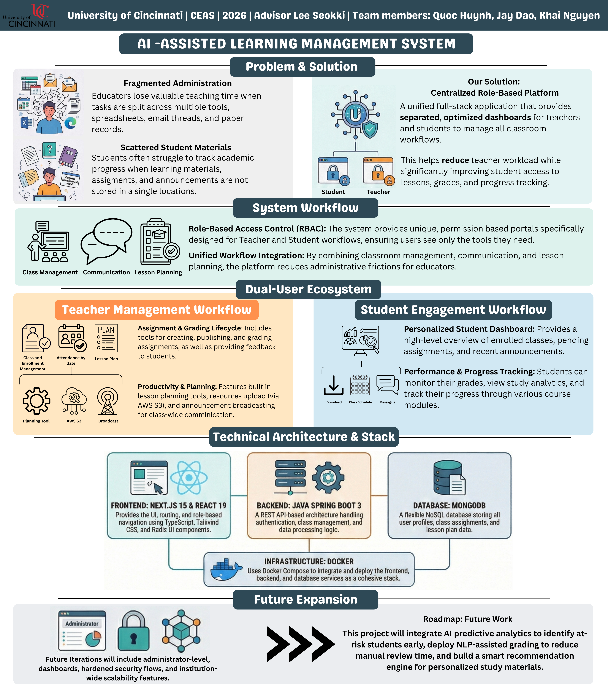
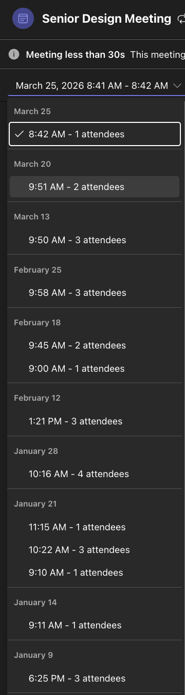

# CS5002 Final Design Report
### Project Rewood - AI-Assisted Learning Management System

**University of Cincinnati, CEAS | Spring 2026**  
**Advisor:** Lee Seokki | seokki.lee@uc.edu  
**Team:** Quoc Huynh · Jay Dao · Khai Nguyen

---

## Table of Contents

1. [Project Description](#1-project-description)
2. [User Interface Specification](#2-user-interface-specification)
3. [Test Plan and Results](#3-test-plan-and-results)
4. [User Manual](#4-user-manual)
5. [Spring Final PPT Presentation](#5-spring-final-ppt-presentation)
6. [Final Expo Poster](#6-final-expo-poster)
7. [Assessments](#7-assessments)
   - [7.1 Initial Self-Assessments (Fall Semester)](#71-initial-self-assessments-fall-semester)
   - [7.2 Final Self-Assessments (Spring Semester)](#72-final-self-assessments-spring-semester)
8. [Summary of Hours and Justification](#8-summary-of-hours-and-justification)
9. [Summary of Expenses](#9-summary-of-expenses)
10. [Appendix](#10-appendix)

---

## 1. Project Description

### Abstract

Project Rewood is an AI-assisted Learning Management System that streamlines classroom administration and enhances language learning. Built on Next.js 15, Spring Boot 3, and FastAPI, it provides role-based portals for teachers and students with AI-powered features including context-aware Q&A chat, quiz generation, flashcard creation, direct translation on document viewer via a RAG pipeline backed by Qdrant and Google Gemini.

### 1.1 Problem Statement

Educators managing small-scale language courses face compounding administrative overhead: organizing and distributing course materials, creating assessment content, monitoring individual student progress, and maintaining student communication. Existing LMS solutions lack domain-specific intelligence for language learning and fail to reduce the authoring burden on instructors. Simultaneously, students lack a unified, contextually-aware study environment that connects their assigned documents to intelligent practice tools.

### 1.2 Project Focus

The project addresses these gaps across four primary areas:

**Course & Resource Management:** Teachers upload course documents (PDF), which are automatically converted, indexed, and made available to students through an interactive resource browser with an in-app PDF viewer.

**Role-Based Authentication & Access Control:** The platform enforces strict role separation (Student, Teacher, Center Admin, Admin) at both the middleware and API layer, with NextAuth session management and a Spring Boot OAuth2-backed Java backend.

**AI-Powered Learning Tools:** Students interact with a streaming AI chat assistant constrained to their selected course materials (via RAG and Context Engineering), generate multiple-choice quizzes, translating new vocabulary on built-in document viewer with smart context awareness, and frictionless 1-click flashcards builder on any topic covered in the course.

**Teacher Productivity & Monitoring:** Teachers gain a student-progress dashboard aggregating enrollment, grades, assignment submission status, and study analytics. An on-demand AI summary feature produces a professional performance narrative for any individual student.

### 1.3 Technology Stack

| Layer | Technology |
|---|---|
| Frontend | Next.js 15 (App Router), React 19, TypeScript, Tailwind CSS, shadcn/ui |
| Backend | Spring Boot 3.4.4, Java 17, Spring Security, SpringDoc OpenAPI |
| AI Microservice | FastAPI, Python 3.12, LlamaIndex, Google Gemini 2.5 Flash |
| Vector Database | Qdrant |
| Application Database | MongoDB (Mongoose in Next.js; Spring Data MongoDB in backend) |
| File Storage | AWS S3 (presigned uploads); shared Docker volume for AI-generated media |
| Containerization | Docker Compose (7-service stack) |
| Authentication | NextAuth v4, Spring Boot OAuth2 Resource Server |

### 1.4 Team Members and Roles

| Member | Email | Role |
|---|---|---|
 Quoc Huynh | huynhqk@mail.uc.edu | AI Service & Documentation: document ingestion, embedding generation, vector indexing in Qdrant, RAG pipeline design (retrieval, context assembly, prompt orchestration), FastAPI implementation (chat streaming, translation, quiz, flashcards), AI-service integration with frontend/backend APIs, and project documentation deliverables across both semesters (reports, presentation materials, and required submissions). |
| Jay (Tung) Dao | daot4@mail.uc.edu | Full-Stack Development Lead: implemented most frontend/backend features, including React/Next.js student and teacher portals, learning feature UI, and system-wide integration/testing support; also contributed to project documentation. |
| Khai Nguyen | nguye2kh@mail.uc.edu | Poster Design: final expo poster layout and visual assets. |

---

## 2. User Interface Specification

### 2.1 Design Approach

The UI follows a role-separated portal model. After authentication, users are automatically routed to their role-specific dashboard. Both portals share a consistent design language built on shadcn/ui primitives and Tailwind CSS, with dark/light theme support.

### 2.2 Teacher Portal (`/dashboard/teacher`)

The teacher dashboard provides an overview panel with recent classes, upcoming assignments, attendance snapshots, and recent messages. The sidebar provides access to:

| Page | Path | Description |
|---|---|---|
| Dashboard | `/dashboard` | Overview tiles: recent classes, assignments, messages, analytics |
| Classes | `/dashboard/classes` | Create/manage classes; enroll and remove students |
| Assignments | `/dashboard/assignments` | Create assignments, set deadlines, review and grade submissions |
| Student Progress | `/dashboard/student-progress` | Aggregate metrics per student with trend charts; on-demand AI narrative |
| Attendance | `/dashboard/attendance` | Mark attendance per class session |
| Resources | `/dashboard/resources` | Upload course documents; files auto-indexed by AI service |
| Lesson Plans | `/dashboard/lesson-plans` | Structured lesson planning tools |
| Announcements | `/dashboard/announcements` | Class-wide announcements |
| Messages | `/dashboard/messages` | Direct messaging to students |
| Productivity | `/dashboard/productivity` | Personal notes and to-do list |
| Profile | `/dashboard/profile` | Account settings and avatar |

### 2.3 Student Portal (`/dashboard/student`)

| Page | Path | Description |
|---|---|---|
| Dashboard | `/dashboard/student` | Enrolled courses, upcoming assignments, study metrics summary |
| My Classes | `/dashboard/student/my-classes` | Course modules and learning content |
| Assignments | `/dashboard/student/assignments` | View, submit, and track assignment deadlines |
| Resources | `/dashboard/student/resources` | Browse course files with in-app interactive PDF viewer |
| AI Chat | `/dashboard/student/chat` | Persistent, session-based streaming AI assistant scoped to selected documents |
| Quiz Practice | `/dashboard/student/quiz` | AI-generated multiple-choice quizzes from course content |
| Flashcards | `/dashboard/student/flashcards` | AI-generated or manual spaced-repetition cards with SM-2 scheduling |
| Grades | `/dashboard/student/grades` | GPA view and per-course grade breakdown |
| Analytics | `/dashboard/student/analytics` | Weekly study time, quiz score trends, course completion |
| Schedule | `/dashboard/student/schedule` | Weekly class schedule view |
| Messages | `/dashboard/student/messages` | Direct messaging with instructors |
| Profile | `/dashboard/student/profile` | Account settings |

### 2.4 Key Interaction Flows

- **AI Chat:** Student selects one or more course documents to scope the assistant → messages stream token-by-token via Server-Sent Events → sessions persist across visits.
- **Quiz generation:** Student enters a topic and question count → AI returns a structured MCQ quiz rendered as an interactive card deck.
- **Flashcards:** Cards flip on click → student rates recall quality → SM-2 algorithm schedules the next review date.
- **Student Progress (Teacher view):** Teacher clicks a student row → detail modal opens with line charts for score trends → "Generate AI Insights" button produces a narrative summary.

> [UI Screenshots — Placeholder]()

---

## 3. Test Plan and Results

> **Full Comprehensive Test Plan:** [Test Plan.pdf](./Test%20Plan.pdf)

### 3.1 Testing Strategy

The comprehensive test plan covers four levels: unit tests for service-layer logic, integration tests for API endpoint behavior, end-to-end browser testing for complete user workflows, and manual exploratory testing across both portals. A total of **23 test cases** are documented covering authentication, AI service ingestion and RAG pipelines, vector database integration, CORS security, PDF parsing, performance metrics, database persistence, and error handling.

### 3.2 Backend (Spring Boot) — JUnit 5 / MockMvc

| Test Area | Scenarios Covered | Result |
|---|---|---|
| AuthController (register/login) | Valid credentials, duplicate email, missing fields | Pass |
| UserController (profile, role update) | Authenticated vs. unauthenticated access | Pass |
| ClassController (CRUD + enrollment) | Create, read, update, delete class; enroll/remove student | Pass |
| LessonPlanController | Teacher-only access enforcement | Pass |
| Assignment submission & grading | Submit as student, grade as teacher, wrong-role rejection | Pass |
| MongoDB persistence | Data written and retrieved correctly across service restarts | Pass |

### 3.3 AI Microservice (FastAPI) — pytest / httpx

| Endpoint | Scenario | Expected | Result |
|---|---|---|---|
| `GET /` | Health check | 200 OK with status message | Pass |
| `POST /upload` | Valid PDF with courseId | 200 with filename and public URL | Pass |
| `POST /upload` | Unsupported file type (.txt) | 400 Bad Request | Pass |
| `POST /upload` | Empty document (no extractable text) | 400 with descriptive error | Pass |
| `POST /translate` | Chinese text + courseId | 200 with pinyin and explanation | Pass |
| `POST /generate-quiz` | Topic + courseId, 5 questions | Valid JSON MCQ with 4 options each | Pass |
| `POST /generate-flashcards` | Topic + courseId, 10 cards | JSON array with front/back pairs | Pass |
| `POST /chat/stream` | Message with courseId + resourceIds | SSE stream ending with `[DONE]` | Pass |


### 3.4 Frontend Integration Tests

| Feature | Scenario | Result |
|---|---|---|
| Registration / Login | New user creation and credential validation | Pass |
| Role-based routing | Student accessing a teacher-only route | Redirected correctly |
| Resource upload → AI index | PDF upload flows through to student resource view | Pass |
| AI Chat (streaming) | Session creation, document scoping, SSE response rendering | Pass |
| Chat persistence | Prior sessions visible after page reload | Pass |
| Quiz generation | Topic entered, quiz rendered with selectable options | Pass |
| Flashcard SM-2 | Reviewing a card advances `nextReviewDate` | Pass |
| Student progress dashboard | Aggregate metrics load; AI narrative generates on demand | Pass |
| Proxy routes | `/api/chat`, `/api/translate`, `/api/generate-quiz` relay correctly | Pass |

### 3.5 Known Limitations

- Backend password comparison is currently plaintext (tech debt; flagged for remediation before production).
- TypeScript strict mode and ESLint are bypassed during build (`ignoreBuildErrors: true`) to support rapid iteration; should be re-enabled before release.
- The AI service Dockerfile creates a legacy `/chroma_data` directory that is unused now that Qdrant is the vector store — cosmetically inert but should be cleaned up.
- Media cleanup runs every 24 hours; files generated immediately before a cleanup cycle may persist up to one extra day beyond the 7-day retention policy.

---

## 4. User Manual

[Full Online User Manual](userguide/user-manual.md)

### 4.1 Installation

**Prerequisites:** Docker Desktop, Git

```bash
git clone <repository-url>
cd Senior-Capstone-Project
cp .env.example .env        
# fill in required credentials
docker compose up --build
```

Application available at `http://localhost:3000`.

**Required environment variables:**

| Variable | Description |
|---|---|
| `GOOGLE_API_KEY` | Google Gemini API key |
| `LLM_MODEL`  |  models/gemini-2.5-flash
| `EMBEDDING_MODEL` | gemini-embedding-001


### 4.2 Teacher Workflow

1. **Register:** Go to `/register`, select role **Teacher**, complete the form.
2. **Create a Class:** Dashboard → Classes → New Class. Enter title, subject, and schedule.
3. **Upload Course Materials:** Dashboard → Resources → Upload. Supported formats: PDF, DOCX, PPTX. Files are automatically converted and indexed for AI features.
4. **Create an Assignment:** Dashboard → Assignments → New Assignment. Set title, description, deadline, and type (homework, quiz, project, or exam).
5. **Monitor Students:** Dashboard → Student Progress. Click any student row to open the detail modal with score trend charts. Click **Generate AI Insights** to produce an AI-written performance narrative.
6. **Communicate:** Dashboard → Announcements to post class-wide notices; Dashboard → Messages for direct student communication.

### 4.3 Student Workflow

1. **Register:** Go to `/register`, select role **Student**.
2. **Access Classes:** Dashboard → My Classes to view enrolled courses and modules.
3. **Read Course Materials:** Dashboard → Resources → select a course → open any file in the in-app PDF viewer.
4. **Chat with AI:** Open AI Chat → select a document from your course → ask questions. Responses are grounded in the selected document content and streamed in real time.
5. **Practice with Quizzes:** Dashboard → Quiz Practice → enter a topic and number of questions → start the AI-generated quiz.
6. **Use Flashcards:** Dashboard → Flashcards → generate cards from a topic or create manually → review due cards daily. The system tracks recall and schedules the next review automatically.
7. **Track Progress:** Dashboard → Analytics to view weekly study time, average quiz scores, and course completion percentage.

### 4.4 Frequently Asked Questions

**Q: Why is the AI Chat option unavailable?**  
AI Chat requires at least one course document to be uploaded and indexed by a teacher. Confirm with your instructor that materials have been added to your course.

**Q: What file types can teachers upload?**  
PDF, DOCX, DOC, PPTX, and PPT. Other formats (e.g., plain text, images) are rejected at upload time with an error message.

**Q: Quiz or flashcard generation is taking a long time—is something broken?**  
AI generation typically takes 10–30 seconds depending on document size and server load. A loading indicator displays during generation. If it times out, try a shorter topic or fewer items.

**Q: Can I resume a previous AI chat session?**  
Yes. The AI Chat page lists all past sessions. Click any session to resume the full conversation.

**Q: How do I re-index documents or reset the environment?**  
Run `./ops.sh` from the project root. It provides `reingest`, `cleanup`, and `seed` maintenance commands.

**Q: Can I change my role after registering?**  
Roles can only be changed by an Administrator through the Admin portal.

**Q: Is student data kept private?**  
All data is stored within your self-hosted instance. The only external service that receives content is Google Gemini (for LLM inference), which receives only the text of uploaded course documents.

---

## 5. Spring Final PPT Presentation

[Presentation Slides](https://docs.google.com/presentation/d/1r71_P9OkHoM16P282MtPAx9RJPTrx5oVXo7z3vfVJRw/edit?usp=sharing)
---

## 6. Final Expo Poster



---

## 7. Assessments

### 7.1 Initial Self-Assessments (Fall Semester)

**Quoc Huynh - Initial Self-Assessment**
**(Condensed Version)**

My senior project is an **AI-assisted Learning Management System (LMS)** designed to streamline classroom administration and enhance the student learning experience. This capstone serves as a bridge between my academic foundation and professional proficiency, specifically within the AI field.

My curriculum at the **University of Cincinnati** provided the framework for this project:
* **CS 3050 (Software Engineering):** Agile methodologies and version control via GitHub.
* **CS 4051 (Database Systems):** Designing robust schemas for users and course modules.
* **CS 4052 (Operating Systems):** Managing concurrency and resource allocation in a multi-user environment.

I am applying lessons from my diverse work history to ensure high-quality delivery:
* **AtriCure, Inc. & INCOM:** I’m using my experience in data pipelines and automated CI/CD flows (which previously reduced manual work by 90%) and rigorous code reviews (resolving 200+ bugs) to maintain a clean, scalable codebase.
* **UI/UX & IT Support:** My background in front-end development at INCOM and user support at CATER ensures the platform is both intuitive and reliable.

Driven by a desire to build technology that helps people, I am leading the AI implementation. Our team is utilizing a **phased MVP approach**, focusing first on core functionalities—authentication and course management—before integrating advanced AI tools. 

Success will be defined by a fully functional, deployed web application that meets all proposal requirements. Personally, this project serves as a definitive portfolio piece, showcasing my ability to innovate, collaborate, and deliver a high-quality product from concept to completion.

### 7.2 Final Self-Assessments (Spring Semester)

**Quoc Huynh - Final Self-Assessment — Placeholder**

My primary individual contribution to "AI-LMS" was the end-to-end design and development of
the platform's AI microservice. Building upon the foundational software development and
programming skills I identified in my initial assessment, I also expanded my technical knowledge
into the area of artificial intelligence. I architected a standalone Python application dedicated to
processing intelligent requests, focusing heavily on implementing Retrieval-Augmented
Generation (RAG) for contextual question-answering to aid users in language pronunciation.
This involved building a scalable architecture using FastAPI and Gemini API to handle
document parsing, vector retrieval, helping students utilize AI on learning (learning chatbot, quiz
generation, flashcard builder, etc.) and teachers on performance monitoring.

To accomplish this, I developed modules, such as rag_service.py, and containerized the entire
ecosystem using Docker to ensure environment consistency. Through this process, I built
microservice architecture, worked on prompt engineering, AI model integration, and
orchestrating containers. My success was delivering a robust, queryable service that
successfully augmented the core learning management system with dynamic intelligence.
However, I encountered significant obstacles when establishing reliable inter-service
communication within our Docker Compose network. Managing the latency of AI dependencies
and aligning my Python-based endpoints with the Java Spring Boot backend required extensive
debugging, testing, and refinement to ultimately achieve a seamless user experience.

---

## 8. Summary of Hours and Justification

### Fall Semester

| Member | Hours |
|---|---|
| Quoc Huynh | 45 |
| Jay (Tung) Dao | 45 |
| Khai Nguyen | ? |
| **Fall Total** | **?** |

### Spring Semester

| Member | Hours |
|---|---|
| Quoc Huynh | 45 |
| Jay (Tung) Dao | 45 |
| Khai Nguyen | ? |
| **Spring Total** | **?** |

### Full-Year Total

| Member | Total Hours |
|---|---|
| Quoc Huynh | 90 |
| Jay (Tung) Dao | 90 |
| Khai Nguyen | ? |
| **Project Total** | **?** |

### Justification

**Quoc Huynh — AI Service & Cross-Service Integration**  
Quoc's 90 hours were invested across research, AI-service development, and full-stack integration. In the research phase, he evaluated RAG architectures, compared vector database options (Qdrant vs. Chroma), and studied LlamaIndex and Google Gemini APIs to determine the most suitable stack for a document-grounded tutoring system. The majority of his hours went into designing and implementing the FastAPI AI microservice: building the document ingestion pipeline (PDF parsing, chunking, metadata tagging, embedding generation), the Qdrant vector store wrapper, and the RAG-powered endpoints for chat streaming, translation, quiz generation, and flashcard creation. He also authored the prompt-engineering logic that constrains model responses to selected course documents and added citation trails to each answer. Beyond the AI service itself, Quoc carried out the integration work that connected it to the Next.js frontend (proxy routes, SSE streaming relay, session persistence) and the Spring Boot backend (secure token propagation, assignment data fetching, CORS configuration). He also owned the project documentation deliverables—technical reports, architecture notes, and required submissions—throughout both semesters.

**Jay (Tung) Dao - Full-Stack Development**  
Jay's 90 hours were focused on implementing the majority of the platform's frontend and backend features. On the frontend, he built the React/Next.js student and teacher portals, the responsive layout and navigation, the AI chat interface (session management, document scoping, streaming token rendering), quiz practice page, flashcard system with SM-2 scheduling, interactive PDF viewer, and the student progress dashboard. On the backend side, he contributed to API route development, data model wiring, and system-wide integration/testing support to ensure that the frontend, backend, and AI service worked together end-to-end. Jay also contributed to project documentation.

**Khai Nguyen - Poster Design & Support**  
Khai's hours were spent on the final expo poster layout and visual assets, plus supporting contributions to early project planning, team coordination, and documentation reviews across both semesters.



---

## 9. Summary of Expenses

### Cash Expenditures

**Total: $0.00**

All external services operate within free or academic tiers. No paid cloud compute, storage, or software licenses were purchased.

### Donated Hardware and Software

| Item | Estimated Value | Source |
|---|---|---|
| Google Gemini API (free tier) | $0 | Google AI Studio |
| MongoDB Atlas (free tier) | $0 | MongoDB, Inc. |
| Qdrant (local Docker) | $0 | Qdrant |
| AWS S3 (free tier, first 12 months) | $0 | Amazon Web Services |
| GitHub (free for students) | $0 | GitHub Education |
| Docker Desktop (free for education) | $0 | Docker, Inc. |
| JetBrains IntelliJ IDEA (student license) | $0 | JetBrains |
| VS Code (free) | $0 | Microsoft |
| Development laptops (personal hardware) | ~$3,000 (3 × ~$1,000) | Team members (personal) |

---

## 10. Appendix

### References and Citations

1. Next.js Documentation — [https://nextjs.org/docs](https://nextjs.org/docs)
2. Spring Boot Reference Documentation — [https://docs.spring.io/spring-boot/documentation.html](https://docs.spring.io/spring-boot/documentation.html)
3. FastAPI Documentation — [https://fastapi.tiangolo.com/](https://fastapi.tiangolo.com/)
4. LlamaIndex Documentation — [https://docs.llamaindex.ai/](https://docs.llamaindex.ai/)
5. Qdrant Documentation — [https://qdrant.tech/documentation/](https://qdrant.tech/documentation/)
6. Gemini API Documentation — [https://ai.google.dev/gemini-api/docs](https://ai.google.dev/gemini-api/docs)
7. NextAuth.js v4 Documentation — [https://next-auth.js.org/](https://next-auth.js.org/)
8. SM-2 Spaced Repetition Background (SuperMemo) — [https://www.supermemo.com/en/archives1990-2015/english/ol/sm2](https://www.supermemo.com/en/archives1990-2015/english/ol/sm2)

### Code Repository

[GitHub Repository](https://github.com/duytung13pro/Senior-Capstone-Project/tree/main)

```
Senior-Capstone-Project/
├── frontend/           # Next.js 15 application (React 19, TypeScript)
├── backend/            # Spring Boot 3 backend (Java 17)
├── ai-service/         # FastAPI AI microservice (Python 3.12)
├── scripts/            # Maintenance, seed, and re-index scripts
├── docker-compose.yml  # Full 7-service orchestration
└── ops.sh              # One-command maintenance tooling
```

### Commit History Milestones

| Date | Milestone |
|---|---|
| Feb 2026 | AI service Dockerfile, initial Python dependencies, FastAPI skeleton |
| Mar 13, 2026 | RAG engine, TTS, quiz/flashcard features, PDF viewer, student learning pages |
| Mar 16, 2026 | AI chat UI, chat memory persistence, streaming hardening, upload validation |
| Mar 17, 2026 | AI proxy routes, document scoping, resource normalization, maintenance scripts |
