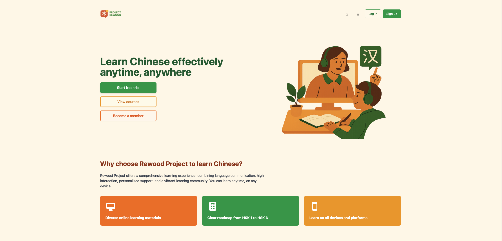

## Getting started

Visit http://localhost:3000(placeholder for real url later)

## Creating An Account

1. Open the application in your browser.
2. Select `Register`.
3. Enter your name, email, password, and role.
4. Choose the role that matches your needs:
   Teacher users should select `Instructor`.
   Student users should select `Student`.
   Admin access is available for project testing and management.
5. Submit the form.

## Signing In

1. Open the login page.
2. Enter your email and password.
3. Select `Login`.
4. After login, the system routes you based on role:
   Teachers go to the teacher dashboard. Go to [Teacher Guide](./teacher-guide.md) 
   Students go to the student dashboard. Go to [Student Guide](./student-guide.md)
   Admins go to the admin dashboard.

## Troubleshooting Basics
- If a page looks incomplete, remember that some features are still under active development.

## Where To Go Next

- Use the [User Manual](./user-manual.md) for more detailed feature instructions.
- Use the [FAQ](./faq.md) for common questions and answers.