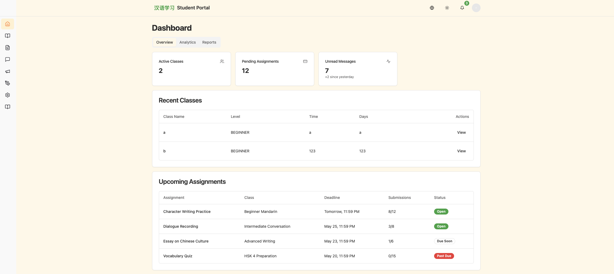

# Student Quick Start

Main student tools include:

- My classes
- Available classes
- Assignments
- Messages
- Grades
- Schedule
- Analytics and progress
- Resources
- Profile updates
## 1. Open The Student Dashboard

After login, students land on a dashboard with shortcuts to classes, assignments, grades, schedule, messages, and study progress.

## 2. Join A Class

Use `Available Classes` to:

- Browse classes that are open for enrollment
- Open the class detail page
- Enroll if the class is available

## 3. Review Current Classes

Use `My Classes` to:

- Open enrolled classes
- See announcements
- Read lesson materials
- Review assignments and class resources

## 4. Complete Assignments

Open `Assignments` to:

- Review assignment instructions
- Track due dates
- Check submission status
- View grading results when available

## 5. Check Grades And Progress

Use `Grades`, `Analytics`, and `Progress` to monitor learning activity and outcomes.

## 6. Read Messages And Resources

Use `Messages` for communication and `Resources` for class materials.

## 7. Manage Your Profile

Use `Profile` to update personal information and settings.

