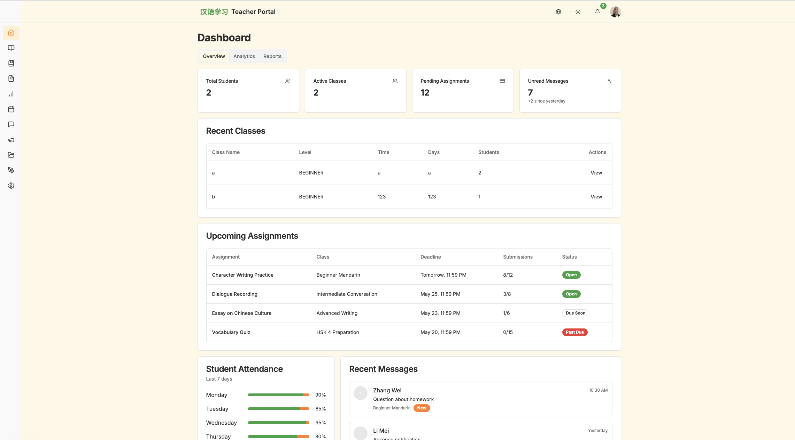

# Teacher Quick Start

Main teacher tools include:

- Class management
- Lesson plans
- Assignments
- Attendance tracking
- Messaging
- Announcements
- Resource sharing
- Productivity tools
- Profile and settings

## 1. Open The Teacher Dashboard

After login, teachers land on the dashboard and can use the left sidebar to move between major features.

## 2. Create Or Review Classes

Go to `My Classes` to:

- View existing classes
- Open a class detail page
- Manage class-related resources
- Review class assignments

## 3. Build Lesson Plans

Open `Lesson Plans` to:

- Create lesson plans
- Review lesson plan details
- Organize instruction for each class

### 4. Publish Assignments

Open `Assignments` to:

- Create a new assignment
- Choose the target class
- Add title, instructions, and due date details
- Review student submissions and grading workflows

## 5. Track Attendance

Open `Attendance` to:

- Select a class
- View the attendance date
- Mark students present, absent, or updated in batch

## 6. Communicate With Students

Use `Messages` and `Announcements` to:

- Send direct communication
- Share updates with a full class
- Keep students informed about class work

## 7. Share Learning Materials

Use `Resources` to upload or manage class materials for students.

## 8. Update Your Profile

Open `Profile & Settings` to update:

- Name
- Avatar
- Phone number
- Bio
- Notification settings
- Preferences
